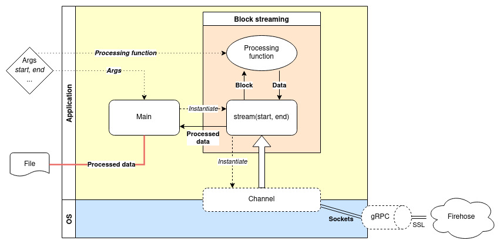
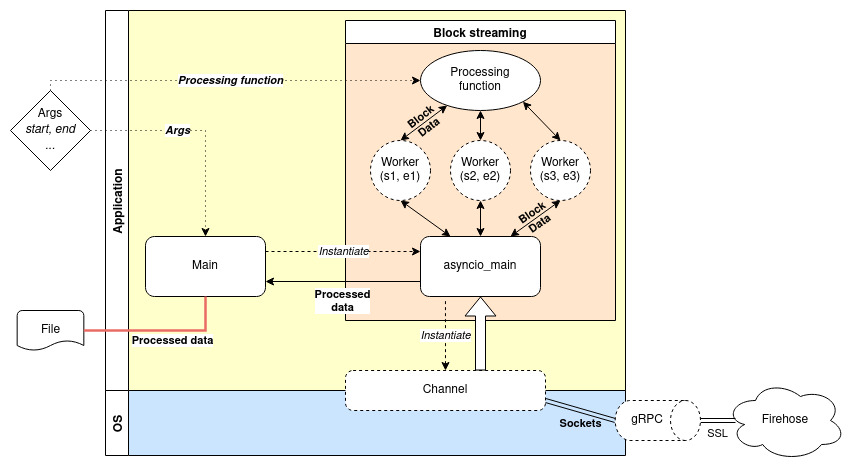
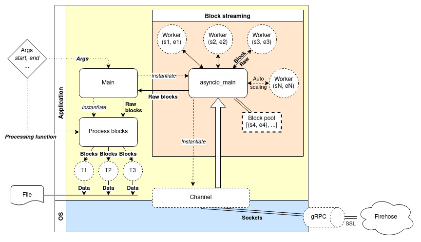
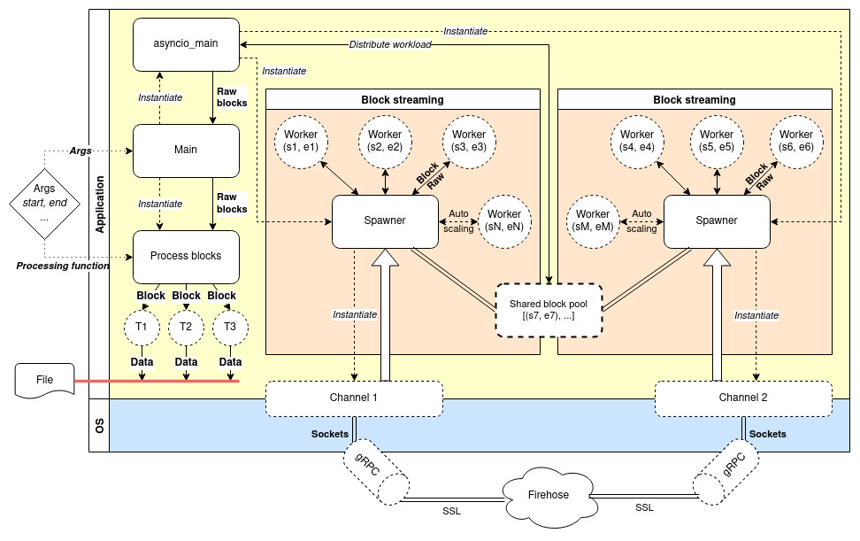
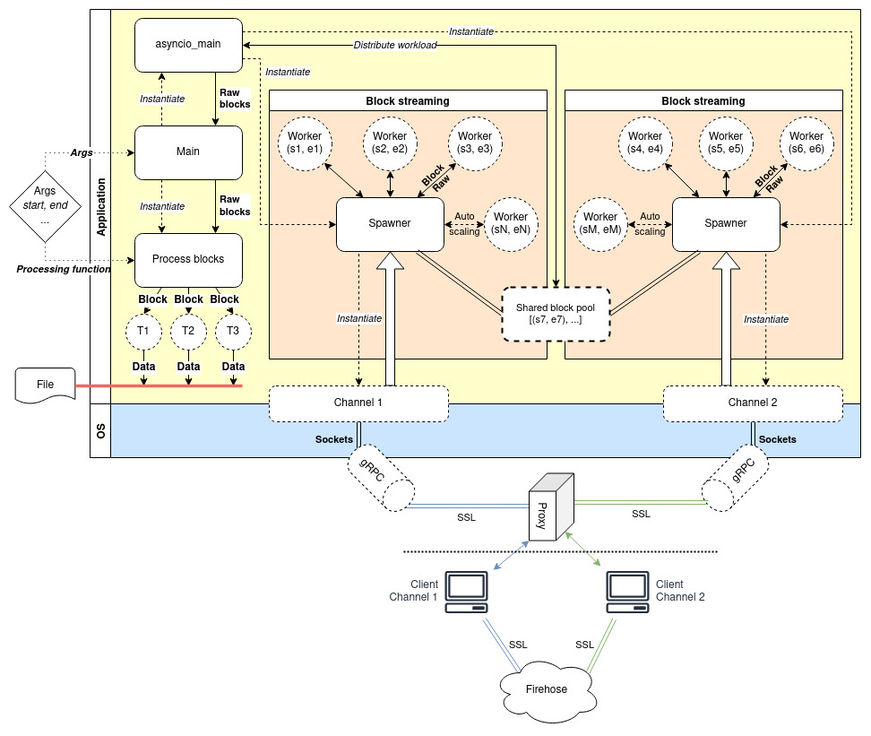

# Firehose data extraction architecture designs

## Context

The five diagrams present in this folder each illustrate a possible architecture for streaming and processing blocks out of a Firehose-enabled endpoint.

Each are described below, ranked by least to most theoretical block throughput. The starting point for all of these is a given period `[start, end]`, indicating the blocks that needs to be processed by the user-supplied *processing function* and stored into an output file.

## Simple synchronous block extraction

As the name suggests, this solution simply stream and process each block from the block range sequentially, in a single function. Once all the data has been processed, it is sent back to the main who will store it into the output file.

**Advantages:**
- Straightforward implementation.
- Gets all the processed data directly.

**Drawbacks:**
- *Very slow* if streaming a substantial amount of blocks due to monotasking.
- Direct block processing can cause streaming bottleneck if the processing function hangs or fail for some blocks, reducing throughput.
- Hard to recover from channel or gRPC failures.

## Simple asynchronous block extraction

The first big step is to move from synchronous operations to asynchronous operations. It allows for efficient *multitasking* by spreading the workload accross multiple *workers*, each assigned a subset of the entire block period. It is **not** equivalent to *multithreading* as all the tasks still run with the same resources as before, only now the computation time is allocated across many different tasks allowing for parallel extraction **and** processing (still) of targeted blocks.

The number of workers and their workload is determined at the start and won't change until all they are all finished. If a worker fails to get all the blocks in its given range, it will be restarted from the failed block **after** all the other workers have finished their task.

**Advantages:**
- Optimization of computation time with parallel execution allow for much faster throughput.
- Fixed amount of workers can be optimized to open as many connection as possible within a single channel.
- Gets all the processed data directly.

**Drawbacks:**
- Direct block processing can still cause streaming bottleneck, reducing throughput.
- Valuable time is lost when a worker fails as it needs to wait for the next polling to restart.
- Number of initial workers has to be known in advance (requires testing and might be implementation/platform/hardware specific).

## Optimized asynchronous block extraction

The next step is to recognize that what limits the speed of block processing is the network. Processing received blocks for data parsing can be done locally and is **fast** as it is only a CPU intensive operation. But the Firehose block extraction process is limited by the network bandwith and no amount of CPU power can change that. Hence, we need to separate the block *extraction* process from the block *processing*. 

This allows for maximum throughput from the gRPC channel as only raw received blocks are stored and will be processed later, when all the data has been gathered from the network. We can also use *worker scaling* to adjust the workload dynamically and restart failed tasks immediately by using a *block pool* holding the remaining blocks to be processed.

Combined with the previous approach of maxing out the number of worker for the channel, this design seems like the most efficient and robust and is what is currently implemented as the [`async_optimized`](../pyfirehose/block_extractors/async_optimized.py) (fixed initial amount of workers) and [`async_single_channel`](../pyfirehose/block_extractors/async_single_channel.py) (autoscaling of workers) block extractors.

 **Advantages:**
- Optimization of computation time by removing block processing allows for even faster throughput.
- Dynamic amount of workers can be optimized to open as many connection as possible within a single channel.
- Allow for external block processing using compiled tools, pipelines, etc.
- Can be extended easily for real-time block processing.

**Drawbacks:**
- Can be slower than previous designs as the worker monitoring can introduce some overhead.
- A bit harder to implement.

## Dream asynchronous block extraction

This design is referred as a "dream" design as its theoretically more efficient than the previous one but not in practice. It comes from a simple observation: if a channel can only support a limited amount of workers, **why not open a new channel** for processing even more blocks in parallel ?

By scaling the previous design we can move the block pool a level higher and have multiple *spawner* tasks managing their own workers with their own channel. The `asyncio_main` watcher job would simply be to watch for saturated or exhausted channels and distribute the workload from the shared block pool accordingly.

Unfortunately, even though opening new channels does seem to work on the client side, the Firehose endpoint won't allow for extracting more blocks out of them. It can be theorized that the gRPC server implementation still sees the two channels as coming from one client and thus killing any more attempts to open additional connections.

An (almost) working PoC can be found as the [`async_multi_channel`](../pyfirehose/block_extractors/async_multi_channel.py) block extractor.

**Advantages:**
- Same as previous, with theoretically more throughput.

**Drawbacks:**
- Additional overhead may reduce performance gains especially when working with smaller block ranges. 
- A bit more harder to implement.

## Dream BIGGER asynchronous block extraction

This design is mostly a meme and an attempt to *possibly* solve the multi-channel problem described previously. If the theory of the *perceived single client* is valid, then we can trick the Firehose endpoint into sending blocks to multiple **different** clients that would in fact be all linked through a *proxy*. This proxy would then, based on which client the data is coming, forward the traffic to the appropriate opened channels on the streaming machine.

This is way too convoluted to be an actual solution and would introduce many more challenges than just trying to solve this problem directly on the server (or the client). But still, it *might* work...

**Advantages:**
- Firehose memelord architect title.

**Drawbacks:**
- Time-cost, money-cost, human-cost, etc.
- It's insane.